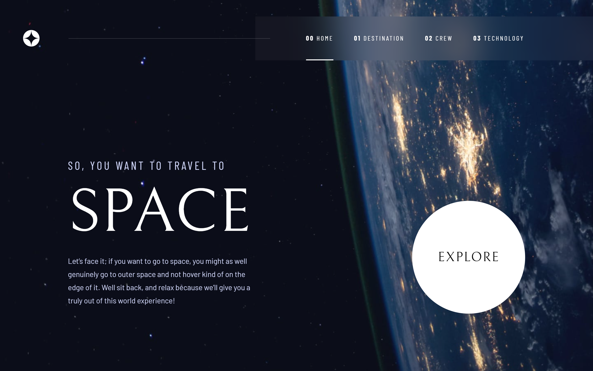
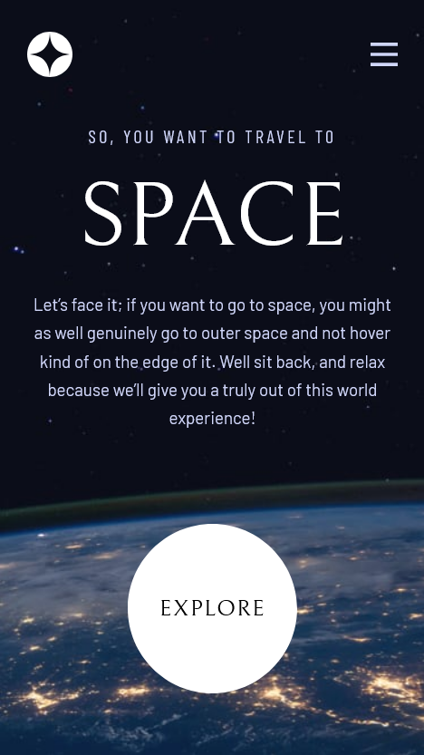

# Gabriel Nassimbeni - Space tourism website solution

This is a solution to the [Space tourism website challenge on Frontend Mentor](https://www.frontendmentor.io/challenges/space-tourism-multipage-website-gRWj1URZ3).

## Table of contents

- [Overview](#overview)
  - [Screenshot](#screenshot)
  - [Links](#links)
  - [The challenge](#the-challenge)
- [My process](#my-process)
  - [Built with](#built-with)
  - [What I learned](#what-i-learned)
  - [Continued development](#continued-development)
  - [Useful resources](#useful-resources)
- [Author](#author)

## Overview

### Screenshot

### Links

- Solution URL: [https://github.com/gabprojects/space-tourism-challenge](https://github.com/gabprojects/space-tourism-challenge)
- Live Site URL: [Add live site URL here](https://your-live-site-url.com)

### The challenge

Develop a space tourism website where users will be able to:

- View the optimal layout for each of the website's pages depending on their device's screen size
- See hover states for all interactive elements on the page
- View each page and be able to toggle between the tabs to see new information

## My process

### Built with

- [React](https://reactjs.org/) - JS library
- [React Router](https://reactrouter.com/en/main) - JS library
- [Vite](https://vitejs.dev/) - Platform-agnostic frontend tool
- [Sass](https://sass-lang.com/) - CSS pre-processor
- [CSS Modules](https://github.com/css-modules/css-modules)
- [Typescript](https://www.typescriptlang.org/) - Programming Language
- Mobile-first workflow

### What I learned

- I learned more about the entire structure of React projects, how to separate global and local components;
- How to use React Router, along with Browser Router, Routes, and Route, to configure page routes;
- How to use JSON objects along with JavaScript to dynamically change page elements;
- How to configure events in React components using props;
- How to build a design system in a React project using SCSS;
- Improve my error-finding skills using Chrome DevTools;
- Build higher-quality responsive pages.

### Continued development

- For the development of new versions of this project or for new projects, I want to add new tools to enhance performance and accessibility, test and improve the site's SEO;
- Simulate the website's back-end to fetch information dynamically;
- Implement smoother transitions for page and tab change effects, such as a carousel for mobile devices;
- Explore new tools to evolve my skills as a Front-End developer.

### Useful resources

- [chatGPT](https://chat.openai.com/) - This AI is a powerful tool to help novice developers understand HTML Elements, CSS Properties and JavaScript Commands, and how to apply them to developing websites.
- [Codepen](https://codepen.io/daph/pen/MydqQB) - Codepen was very useful for identifying errors in the code, with it I can easily identify if a piece of code is wrong or not compatible with a React project.

## Author

- Linkedin - [Gabriel Nassimbeni](https://www.linkedin.com/in/gabrieldoc/)
- Frontend Mentor - [@gabprojects](https://www.frontendmentor.io/profile/gabprojects)